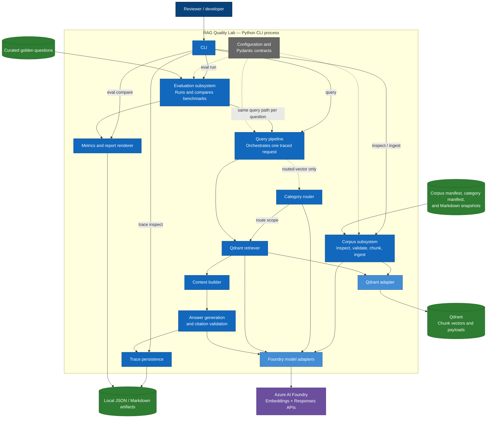
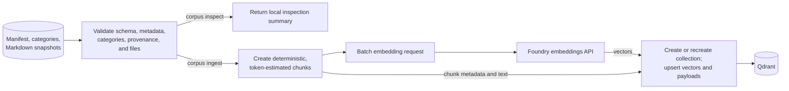
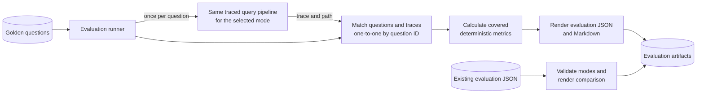

# RAG Quality Lab component architecture

This document describes the implemented components and runtime data flows in
the CLI-first application. It starts with a C4-style component view of the
single Python process, then separates detailed flows into smaller diagrams.

## Component overview

The overview keeps only architectural dependencies. File-level ownership is in
the component-to-code map below.

## Runtime workflows

These smaller views preserve conditional implementation details without forcing
them into the component overview.

### Corpus inspection and ingestion

Corpus inspection ends after validation. It does not contact Foundry or Qdrant.

### One query

```mermaid
flowchart LR
    question["Question"]
    mode{"Retrieval mode"}
    router["Embed question and five<br/>runtime category descriptions"]
    confidence{"Top score meets<br/>threshold?"}
    categories["Winner plus categories<br/>within score margin"]
    global["No category filter"]
    retrieve["Embed question for retrieval;<br/>query Qdrant top-k"]
    context["Admit ranked chunks<br/>within token budget"]
    included{"Any included<br/>chunks?"}
    fixed["Fixed no-answer response"]
    generate["Foundry Responses call<br/>using selected context"]
    citations["Resolve and validate<br/>[C&lt;n&gt;] citations"]
    trace["Persist complete QueryTrace"]

    question --> mode
    mode -->|"baseline-vector"| global
    mode -->|"routed-vector"| router
    router --> confidence
    confidence -->|"yes"| categories
    confidence -->|"no"| global
    categories --> retrieve
    global --> retrieve
    retrieve --> context
    context --> included
    included -->|"no"| fixed
    included -->|"yes"| generate
    generate -->|"answer"| citations
    fixed --> trace
    citations --> trace
```

The router and retriever intentionally make separate embedding calls. Baseline
mode skips the router. Low-confidence routed mode keeps the existing global
fallback by sending the Qdrant query without a category filter.

### Evaluation and comparison

## Runtime distinctions represented in the diagram

- `baseline-vector` bypasses the category router and sends an unfiltered vector
  query to Qdrant.
- `routed-vector` embeds the question and the five code-owned category
  descriptions. It searches the winning category plus categories within the
  configured score margin. If confidence is below the configured threshold,
  the existing global-fallback route removes the category filter.
- `corpus/categories.json` is validated with the corpus manifest, but runtime
  routing descriptions come from `routing/categories.py`; these are separate
  inputs in the implementation.
- Corpus inspection is local-only. Ingestion is the path that calls the
  embedding endpoint and writes to Qdrant.
- The retriever embeds a question for Qdrant independently of the embedding
  work performed by the routed-mode router.
- Context assembly preserves retrieval rank and admits chunks while they fit
  the configured context-token budget. It records excluded chunks rather than
  silently dropping them.
- If the selected context contains no included chunk, generation returns the
  fixed no-answer response without calling the chat model.
- Generation uses `langchain-core` only for prompt and message types. The
  project-owned chat adapter calls the Foundry OpenAI-compatible Responses API.
- Citation validation proves that returned citation labels resolve to chunks
  included in the selected context. It is not claim-level factuality grading.
  For a generated answer, validation occurs while constructing the answer result
  and again when the pipeline records the trace-level validation object.
- Evaluation invokes the same traced query pipeline used by the `query`
  command. It does not have a separate retrieval or generation implementation.
- The curated benchmark reports top-category routing, searched categories,
  retrieval, citation, answerability/no-answer, and token-budget metrics. It
  does not report or draw conclusions about global-fallback behavior.

## Component-to-code map

| Diagram component | Implemented by | Responsibility verified in code |
| --- | --- | --- |
| CLI adapter | `src/rag_quality_lab/cli.py` | Defines `corpus`, `query`, `trace`, and `eval` commands; maps errors and renders human/JSON output. |
| Configuration | `src/rag_quality_lab/config.py` | Validates Foundry, Qdrant, retrieval, routing, token-budget, and artifact-path settings. |
| Corpus inspection and validation | `corpus/inspect.py`, `corpus/manifest.py` | Validates schema versions, source metadata, category coverage, provenance paths, and readable local snapshots. |
| Ingestion orchestrator | `corpus/ingest.py` | Coordinates validation, chunking, batch embedding, collection setup, and vector upsert. |
| Markdown chunker | `corpus/chunking.py` | Produces deterministic, token-estimated chunks with stable IDs, section paths, hashes, and provenance. |
| Embedding provider | `providers.py` | Calls the configured Foundry OpenAI-compatible embeddings resource and normalizes vectors and usage. |
| Category router | `routing/categories.py`, `routing/embedding_router.py` | Embeds fixed category descriptions, scores cosine similarity, selects a category, or emits the existing low-confidence global route. |
| Query pipeline and retriever | `rag/pipeline.py` | Selects retrieval mode, composes live adapters, applies multi-category margin logic, and orchestrates the complete query. |
| Qdrant adapter | `retrieval/qdrant_store.py` | Creates cosine collections, stores chunk payloads, and performs global or category-filtered vector queries. |
| Context builder | `rag/context.py` | Converts ranked results into included and budget-excluded context chunks. |
| Answer generator | `rag/generation.py`, `chat_models.py` | Builds the source-only prompt, invokes the Responses API, recognizes no-answer output, and records model usage. |
| Citation validator | `rag/citations.py` | Maps `[C<n>]` aliases to included chunk IDs and reports missing, malformed, or out-of-context citations. |
| Trace persistence | `rag/traces.py`, `schemas/artifacts.py` | Writes and validates complete `QueryTrace` JSON artifacts. |
| Evaluation runner | `eval/golden.py`, `eval/reports.py` | Loads golden questions, invokes the query pipeline per question, matches results by question ID, and assembles evaluation runs. |
| Metrics and reports | `eval/metrics.py`, `eval/reports.py` | Calculates covered deterministic metrics and writes per-run and comparison JSON/Markdown outputs. |
| Domain contracts | `schemas/` | Defines validated corpus, routing, retrieval, context, answer, trace, and evaluation models shared across boundaries. |

## Deliberate boundaries

The implementation has no web UI, HTTP application API, agent loop, live
crawler, reranker, alternate vector-store adapter, or LLM-based evaluation
judge. Those systems are intentionally absent from the diagram because they are
not part of this repository.
