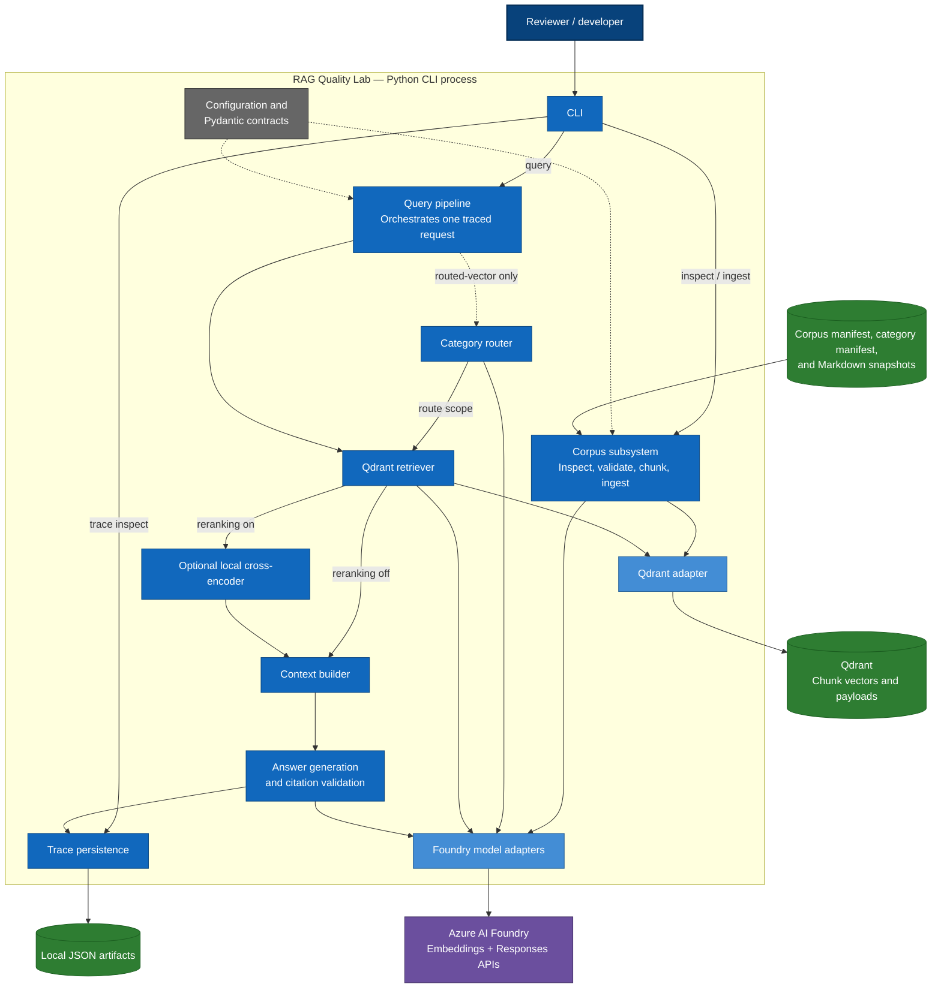
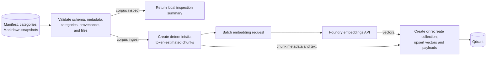
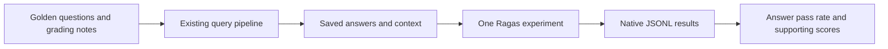

# RAG Quality Lab component architecture

This document describes the implemented components and runtime data flows in
the CLI-first application. It starts with a C4-style component view of the
single Python process, then separates detailed flows into smaller diagrams.

## Component overview

The overview keeps only architectural dependencies. File-level ownership is in
the component-to-code map below.

```mermaid
flowchart TB
    reviewer["Reviewer / developer"]
    corpus_input[("Corpus manifest, category manifest,<br/>and Markdown snapshots")]
    foundry["Azure AI Foundry<br/>Embeddings + Responses APIs"]
    qdrant[("Qdrant<br/>Chunk vectors and payloads")]
    artifacts[("Local JSON artifacts")]

    subgraph app["RAG Quality Lab — Python CLI process"]
        cli["CLI"]
        corpus["Corpus subsystem<br/>Inspect, validate, chunk, ingest"]
        query["Query pipeline<br/>Orchestrates one traced request"]

        router["Category router"]
        retrieval["Qdrant retriever"]
        rerank["Optional local cross-encoder"]
        context["Context builder"]
        answer["Answer generation<br/>and citation validation"]
        traces["Trace persistence"]

        model_adapters["Foundry model adapters"]
        qdrant_adapter["Qdrant adapter"]
        contracts["Configuration and<br/>Pydantic contracts"]

        cli -->|"inspect / ingest"| corpus
        cli -->|"query"| query
        cli -->|"trace inspect"| traces

        query -.->|"routed-vector only"| router
        router -->|"route scope"| retrieval
        query --> retrieval
        retrieval -->|"reranking off"| context
        retrieval -->|"reranking on"| rerank
        rerank --> context
        context --> answer
        answer --> traces

        corpus --> model_adapters
        corpus --> qdrant_adapter
        router --> model_adapters
        retrieval --> model_adapters
        retrieval --> qdrant_adapter
        answer --> model_adapters

        contracts -.-> corpus
        contracts -.-> query
    end

    reviewer --> cli
    corpus_input --> corpus
    model_adapters --> foundry
    qdrant_adapter --> qdrant
    traces --> artifacts

    classDef person fill:#08427b,color:#fff,stroke:#052e56,stroke-width:2px;
    classDef component fill:#1168bd,color:#fff,stroke:#0b4884;
    classDef adapter fill:#438dd5,color:#fff,stroke:#2d6599;
    classDef datastore fill:#2e7d32,color:#fff,stroke:#1b5e20;
    classDef external fill:#6b4f9e,color:#fff,stroke:#463268;
    classDef contract fill:#666,color:#fff,stroke:#333;

    class reviewer person;
    class cli,corpus,query,router,retrieval,rerank,context,answer,traces component;
    class model_adapters,qdrant_adapter adapter;
    class corpus_input,qdrant,artifacts datastore;
    class foundry external;
    class contracts contract;
```

## Runtime workflows

These smaller views preserve conditional implementation details without forcing
them into the component overview.

### Corpus inspection and ingestion

```mermaid
flowchart LR
    inputs[("Manifest, categories,<br/>Markdown snapshots")]
    validate["Validate schema, metadata,<br/>categories, provenance, and files"]
    inspect["Return local inspection summary"]
    chunk["Create deterministic,<br/>token-estimated chunks"]
    embed["Batch embedding request"]
    foundry["Foundry embeddings API"]
    write["Create or recreate collection;<br/>upsert vectors and payloads"]
    qdrant[("Qdrant")]

    inputs --> validate
    validate -->|"corpus inspect"| inspect
    validate -->|"corpus ingest"| chunk
    chunk --> embed
    embed --> foundry
    foundry -->|"vectors"| write
    chunk -->|"chunk metadata and text"| write
    write --> qdrant
```

Corpus inspection ends after validation. It does not contact Foundry or Qdrant.

Chunking excludes the normalized snapshots' administrative metadata and
reference-list headings by exact name. Source files and chunk provenance remain
intact. Embeddings use the document title, section path, and passage body;
retrieval payloads keep the original passage body and its token estimate. The
index fingerprint includes exact embedding input, so title or embedding-format
changes require a fresh collection or an explicit rebuild.

### One query

```mermaid
flowchart LR
    question["Question"]
    mode{"Retrieval mode"}
    router["Embed question and five<br/>runtime category descriptions"]
    confidence{"Top score meets<br/>threshold?"}
    categories["Winner plus categories<br/>within score margin"]
    global["No category filter"]
    retrieve["Embed question for retrieval;<br/>query Qdrant"]
    rerank["Local cross-encoder<br/>reorders candidate shortlist"]
    context["Admit at most top-k chunks<br/>within token budget"]
    included{"Any included<br/>chunks?"}
    fixed["Fixed no-answer response"]
    generate["Foundry Responses call<br/>using selected context"]
    citations["Resolve and validate<br/>[C&lt;n&gt;] citations"]
    trace["Persist complete QueryTrace"]

    question --> mode
    mode -->|"baseline-vector"| global
    mode -->|"routed-vector"| router
    router --> confidence
    confidence -->|"yes"| categories
    confidence -->|"no"| global
    categories --> retrieve
    global --> retrieve
    retrieve -->|"reranking off: top-k results"| context
    retrieve -->|"reranking on: candidate-k results"| rerank
    rerank --> context
    context --> included
    included -->|"no"| fixed
    included -->|"yes"| generate
    generate -->|"answer"| citations
    fixed --> trace
    citations --> trace
```

The router and retriever intentionally make separate embedding calls. Baseline
mode skips the router. Low-confidence routed mode keeps the existing global
fallback by sending the Qdrant query without a category filter.

Reranking is independent of category routing. With `--rerank`, both modes retrieve
20 candidates by default. FastEmbed scores the question against each passage's
section path and body using a local ONNX cross-encoder. The context builder admits
up to five chunks within 1,000 estimated tokens in rerank order, skipping passages
that do not fit. It records `chunk_limit_exceeded` and `budget_exceeded` separately.

`retrieval_results` retains vector ranks and scores. Optional `reranking` records
the model, elapsed milliseconds, and every candidate's new rank and score.
Context chunks retain `retrieval_rank` and add optional `rerank_rank`; old traces
without reranking fields remain readable. During evaluation, source hit/MRR use
reranked order when enabled; actual selected chunks drive answer scoring.
The evaluator reuses one lazily loaded reranker instance across questions.

## Runtime distinctions represented in the diagram

- `baseline-vector` bypasses the category router and sends an unfiltered vector
  query to Qdrant.
- `routed-vector` embeds the question and the five code-owned category
  descriptions. It searches the winning category plus categories within the
  configured score margin. If confidence is below the configured threshold,
  the existing global-fallback route removes the category filter.
- `corpus/categories.json` is validated with the corpus manifest, but runtime
  routing descriptions come from `routing/categories.py`; these are separate
  inputs in the implementation.
- Corpus inspection is local-only. Ingestion is the path that calls the
  embedding endpoint and writes to Qdrant.
- The retriever embeds a question for Qdrant independently of the embedding
  work performed by the routed-mode router.
- Context assembly follows vector rank or, when enabled, rerank order, while
  retaining the original vector rank. Both the chunk limit and token budget
  constrain selection, and exclusions have explicit reasons.
- If the selected context contains no included chunk, generation returns the
  fixed no-answer response without calling the chat model.
- Generation uses `langchain-core` only for prompt and message types. The
  project-owned chat adapter calls the Foundry OpenAI-compatible Responses API.
- Citation validation proves that returned citation labels resolve to chunks
  included in the selected context. It is not claim-level factuality grading.
  For a generated answer, validation occurs while constructing the answer result
  and again when the pipeline records the trace-level validation object.
## Component-to-code map

| Diagram component | Implemented by | Responsibility verified in code |
| --- | --- | --- |
| CLI adapter | `src/rag_quality_lab/cli.py` | Defines `corpus`, `query`, and `trace` commands; maps errors and renders human/JSON output. |
| Configuration | `src/rag_quality_lab/config.py` | Validates Foundry, Qdrant, retrieval, routing, token-budget, and artifact-path settings. |
| Corpus inspection and validation | `corpus/inspect.py`, `corpus/manifest.py` | Validates schema versions, source metadata, category coverage, provenance paths, and readable local snapshots. |
| Ingestion orchestrator | `corpus/ingest.py` | Coordinates validation, chunking, batch embedding, collection setup, and vector upsert. |
| Markdown chunker | `corpus/chunking.py` | Produces deterministic, token-estimated chunks with stable IDs, section paths, hashes, and provenance. |
| Embedding provider | `providers.py` | Calls the configured Foundry OpenAI-compatible embeddings resource and normalizes vectors and usage. |
| Category router | `routing/categories.py`, `routing/embedding_router.py` | Embeds fixed category descriptions, scores cosine similarity, selects a category, or emits the existing low-confidence global route. |
| Query pipeline and retriever | `rag/pipeline.py` | Selects retrieval mode, composes live adapters, applies multi-category margin logic, and orchestrates the complete query. |
| Qdrant adapter | `retrieval/qdrant_store.py` | Creates cosine collections, stores chunk payloads, and performs global or category-filtered vector queries. |
| Local reranker | `retrieval/reranking.py` | Lazily loads a FastEmbed cross-encoder, scores candidates, and preserves both rankings. |
| Context builder | `rag/context.py` | Selects context in the active ranking order, enforcing token and chunk limits. |
| Answer generator | `rag/generation.py`, `chat_models.py` | Builds the source-only prompt, invokes the Responses API, recognizes no-answer output, and records model usage. |
| Citation validator | `rag/citations.py` | Maps `[C<n>]` aliases to included chunk IDs and reports missing, malformed, or out-of-context citations. |
| Trace persistence | `rag/traces.py`, `schemas/artifacts.py` | Writes and validates complete `QueryTrace` JSON artifacts. |
| Domain contracts | `schemas/` | Defines validated corpus, routing, retrieval, context, answer and trace models shared across boundaries. |

## Deliberate boundaries

The implementation has no web UI, HTTP application API, agent loop, live
crawler, or alternate vector-store adapter. Evaluation uses one native
Ragas experiment over saved query inputs. Benchmark cases and labels remain
in `golden/questions.json`.

## Evaluation flow

```mermaid
flowchart LR
    questions[Golden questions and grading notes] --> capture[Existing query pipeline]
    capture --> inputs[Saved answers and context]
    inputs --> experiment[One Ragas experiment]
    experiment --> results[Native JSONL results]
    results --> summary[Answer pass rate and supporting scores]
```

Read `eval/runner.py` for the workflow and terminal summary, and `eval/metrics.py`
for metric calls and diagnostics. Ragas owns the saved
answers dataset, experiment scheduling, and result storage. Rows contain the
fields needed for scoring; no manifest, checksum, or full trace snapshot is needed.
Each `eval run` generates and scores fresh answers. The saved files support
inspection; there is no saved-run loader, rescoring path, or comparison command.
See the README for commands and limitations.
The primary metric is a native Ragas DiscreteMetric using the question, grading
notes, response, and selected context. Faithfulness and expected-source coverage
support diagnosis. Routing/citation/refusal checks remain diagnostics.
Evaluation uses only a judge deployment; generation still uses its own embeddings.
